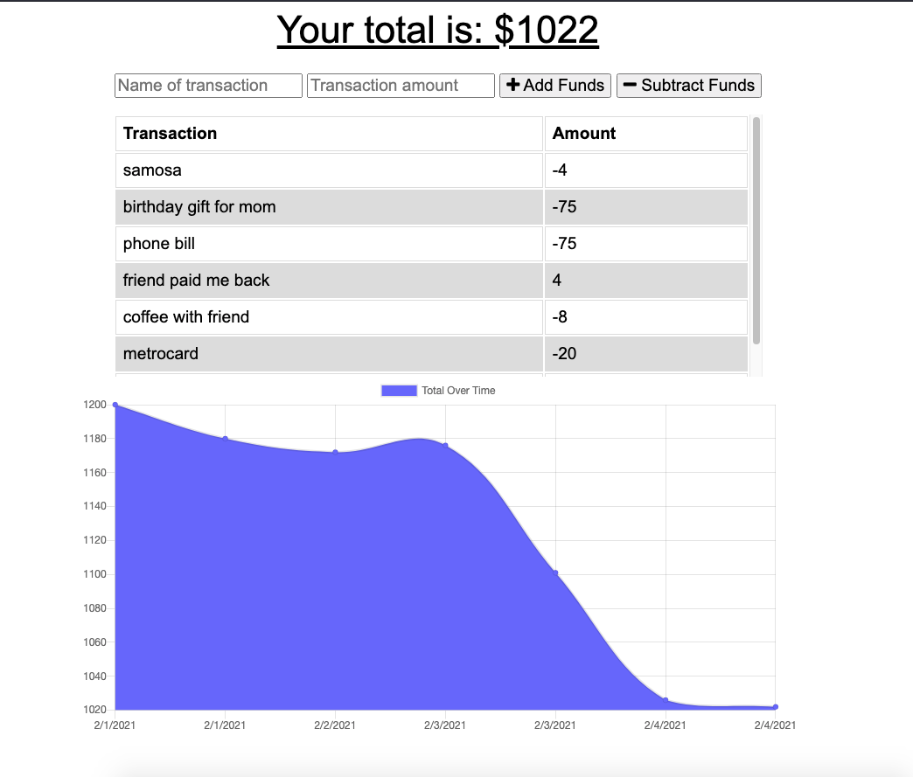

  
# Budget-Tracker

## Project Description 
Budget Tracker is a progressive web application that saves your total balance regardless of whether you have an internet connection. Budget Tracker uses an Express powered server and IndexedDB (a JavaScript-based object-oriented database) to safely store your entries. You can add add funds or subtract from the balance as you travel and be sure that your information will be stored and the right total is always shown. 

## Installation 
Go to [https://enigmatic-woodland-66371.herokuapp.com/](https://enigmatic-woodland-66371.herokuapp.com/) and start adding and subtracting transactions! Alternatively, you can clone this repo to your local device,  run `npm install` to install all dependencies, and then `run node server.js` in the CLI.

## License
This project is licensed under MIT License. Not sure what that means? Please check out [choosealicense.com/licenses/](https://choosealicense.com/licenses/) for more information.